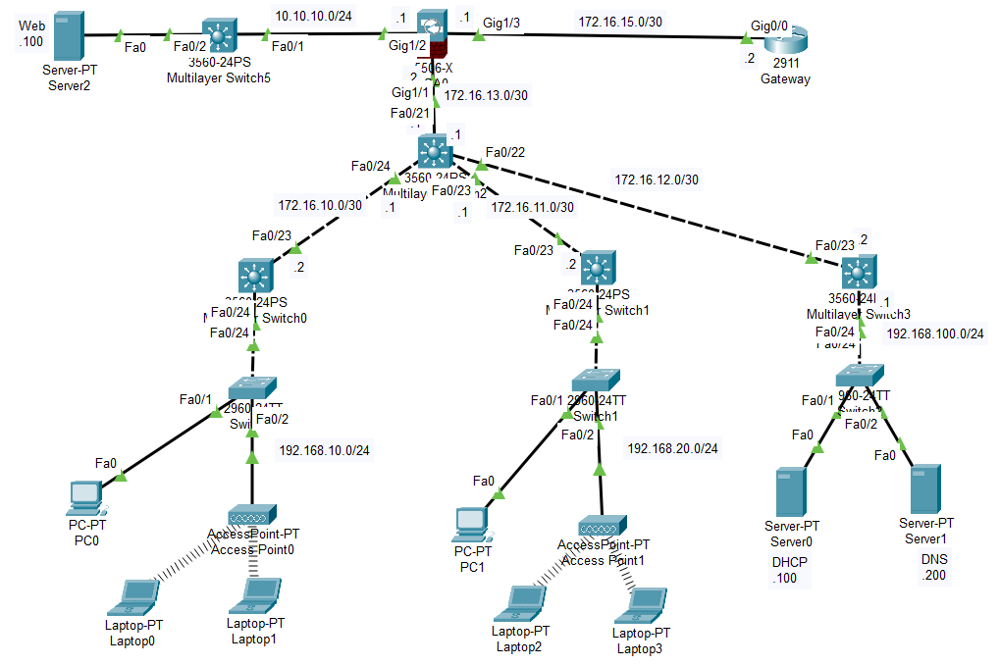

# 🔐 Enterprise LAN Network Simulation (Cisco Packet Tracer)

## 📖 Giới thiệu

Dự án mô phỏng hệ thống mạng doanh nghiệp sử dụng Cisco Packet Tracer, bao gồm thiết kế mạng LAN nhiều tầng kết hợp định tuyến động.

Mô hình triển khai:

* Core Layer (Multilayer Switch)
* Distribution Layer
* Access Layer
* DMZ (Web Server)
* ASA Firewall kết nối ra Internet (Gateway)

---

## 🧠 Mục tiêu

* Hiểu và triển khai mô hình mạng phân tầng (Hierarchical Network Design)
* Cấu hình định tuyến động OSPF
* Áp dụng NAT và kiểm soát truy cập
* Thiết kế vùng DMZ để bảo vệ hệ thống nội bộ
* Thực hành cấu hình ASA Firewall

---

## 🛠️ Công nghệ sử dụng

* Cisco Packet Tracer
* OSPF (Open Shortest Path First)
* ASA Firewall
* NAT (Network Address Translation)
* ACL (Access Control List)
* VLAN & Inter-VLAN Routing

---

## 🌐 Topology

---

## ⚙️ Mô tả hệ thống

### 🔹 Core Layer

* Multilayer Switch trung tâm xử lý routing
* Kết nối đến các Distribution Switch
* Các mạng /30 dùng cho point-to-point

### 🔹 Distribution Layer

* Chia tải và định tuyến giữa các VLAN
* Kết nối xuống Access Layer

### 🔹 Access Layer

* Cung cấp kết nối cho:

  * PC
  * Laptop (qua Access Point)
* Các mạng nội bộ:

  * 192.168.10.0/24
  * 192.168.20.0/24
  * 192.168.100.0/24

### 🔹 Server Zone

* DHCP Server: cấp IP động
* DNS Server: phân giải tên miền

### 🔹 DMZ

* Web Server (10.10.10.0/24)
* Cho phép truy cập từ bên ngoài

### 🔹 Security & Edge

* ASA Firewall:

  * Phân vùng: inside / outside / DMZ
  * Kiểm soát truy cập
* Router Gateway:

  * Kết nối ra mạng ngoài

---

## 🔥 Tính năng chính

* ✅ Định tuyến động OSPF giữa các router/switch
* ✅ NAT cho phép truy cập Internet
* ✅ Phân tách mạng bằng VLAN
* ✅ DMZ bảo vệ server công khai
* ✅ DHCP cấp phát IP tự động
* ✅ DNS server hoạt động nội bộ
* ✅ Kết nối không dây qua Access Point

---

## 🧪 Kiểm thử

* Ping giữa các VLAN
* Truy cập Web Server từ mạng ngoài
* Nhận IP từ DHCP
* Phân giải DNS
* Kiểm tra rule trên ASA Firewall

---

## 📌 Kiến thức đạt được

* Thiết kế mạng doanh nghiệp thực tế
* Cấu hình OSPF trong môi trường nhiều router
* Hiểu cơ chế hoạt động của ASA Firewall
* Áp dụng NAT và ACL trong bảo mật mạng
* Triển khai DMZ đúng chuẩn

---

## 🚀 Hướng phát triển

* Thêm VPN site-to-site
* Triển khai IDS/IPS
* Logging & Monitoring (Syslog, SNMP)
* Mô phỏng tấn công và phòng thủ (Pentest)

---

## 👤 Tác giả

* Trần Vũ
* Sinh viên ngành An toàn thông tin
* GitHub: https://github.com/HuyVu325

---
